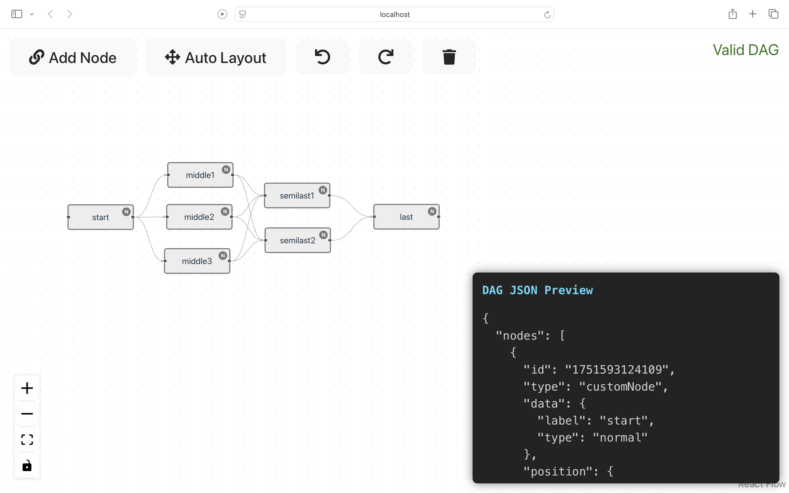

# Pipeline Editor (DAG Builder) - Frontend Intern Assignment

## Setup Instructions

1. Clone the repository:
   ```
   git clone https://github.com/sasankkona/pipeline-editor.git
   ```
2. Navigate to the project directory:
   ```
   cd pipeline-editor
   ```
3. Install dependencies:
   ```
   npm install
   ```
4. Start the development server:
   ```
   npm run dev
   ```
5. Open your browser and go to:
   ```
   http://localhost:5173
   ```

## Notes on Libraries and Decisions

- **React & Vite:** Used React with Vite for fast development and build times.
- **React Flow:** Chosen for graph visualization and interaction due to its React integration and ease of use.
- **Dagre:** Used for auto layout of nodes to improve visual clarity.
- **React Icons:** Used for UI icons to enhance user experience.
- **Custom Node Component:** Created to support color-coded nodes with interactive color selection.
- **Validation Service:** Implemented to ensure the graph is a valid DAG with no cycles, proper connections, and minimum nodes.
- **Layout Service:** Used dagre to compute node positions for auto layout.

## Demo Link

The application is deployed and accessible at:  
[Demo Link]()  


## Screen Recordings & Screenshots



## Challenges Faced

- Implementing real-time DAG validation with cycle detection was complex and required careful graph traversal logic.
- Ensuring correct connection rules (directionality, no self-loops) required custom logic integrated with React Flow's connection handlers.
- Creating an intuitive UI for node type/color selection with an interactive badge and dropdown.
- Managing state updates efficiently to keep nodes, edges, and validation status in sync.
- Handling layout updates with dagre and integrating with React Flow's viewport controls.

## References

- [React Flow Documentation](https://reactflow.dev/)
- [Dagre Layout Library](https://github.com/dagrejs/dagre)
- [React Documentation](https://reactjs.org/)
- [Vite Documentation](https://vitejs.dev/)

---

Thank you for reviewing this assignment!
